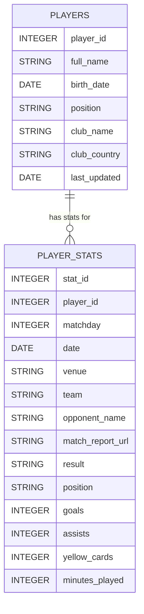

# ⚽ USMNT Data Pipeline - HR Analytics Example

## 🔔 UPDATE June 2026 - Agentic Analyst Added 🤖

> In honor of the World Cup, I took my toy people analytics data example using the US Men's National Team and added an AI powered query assist agent  that  will answer basic and advanced analytics about players and their performance. Accessible via the command line, the agent allows users to ask natural language questions of  their data.

The agent leverages a reason-plan-execute loop to ensure it answers questions accurately and effectively. The architecture is designed to allow multiple such agents to be easily  plugged in - leading to an advanced agentic ecosystem at your fingertips that can be customized based on y our organization's specific needs and use  cases.  

In this lightweight implementation, the main agent creates an execution plan and then taps a DataAgent when needed to assist in answering the user's question. The DataAgent in turn has a few tools at it's disposal to help the main agent answer the query:
 - schema_lookup (investigate the database schema to help determine the appropriate query to return relevant data)
 - run_sql (run the sql query determined in the previous step)
 - compute_stats (calculate stats such as pearson's r, given data and variables to model)
 - clarify (if more information is needed to determine the appropriate data to pull, clarify with the user)

 ### 🔥 **Example questions**:

 **Basic:**
``` console
User: Which player has played the most minutes in the past year?
Agent: *reasoning about question...*  
Agent: **Jonathan Klinsmann** has played the most minutes in the 2025 season, accumulating **3,150 minutes** across **35 matches** for Cesena FC.

This averages out to exactly 90 minutes per match, indicating he's been an ever-present starter—likely as a goalkeeper given the consistency. For context, 35 matches at 90 minutes each suggests he's played essentially every minute of his club's season to date.
```

<details>
  <summary>Full agent trace</summary>

```console
You: Which player has played the most minutes in the past year?

  Reasoning about question...

  --- Reason ---
INTENT: The user wants to identify the player who has accumulated the highest total minutes played across all matches in the past year (last 12 months).
COMPLEXITY: MODERATE
TABLES_NEEDED: player_stats, players
AMBIGUITIES: "Past year" is ambiguous - could mean calendar year 2025, last 12 months from today, or the most recent season; date column format appears inconsistent (MM/DD/YY format) which may complicate date filtering.
DATA_AVAILABLE: PARTIAL — The data contains minutes_played and date columns, but the date format is inconsistent and stored as TEXT, making accurate date-based filtering for "past year" challenging.
  ---

  Building execution plan...

  --- Plan ---
ASSUMPTION: "Past year" is interpreted as the most recent season (2025) since the date column has inconsistent formatting that makes reliable date-based filtering difficult. I will sum total minutes played across all matches in the 2025 season.

STEPS:
1. [run_sql] Aggregate total minutes played per player for the 2025 season, joining with players table to get player names, and return the player with the highest total minutes.
   SQL: SELECT p.full_name, p.club_name, SUM(CAST(ps.minutes_played AS INTEGER)) AS total_minutes, COUNT(*) AS matches_played FROM player_stats ps JOIN players p ON ps.player_id = p.player_id WHERE ps.season = '2025' AND ps.minutes_played IS NOT NULL GROUP BY ps.player_id, p.full_name, p.club_name ORDER BY total_minutes DESC LIMIT 1
  ---

  Executing 1 step(s)...
    Step 1: 1. [run_sql] Aggregate total minutes played per player for the 2025 season, join...

  --- Step 1 tool call ---
{"tool": "run_sql", "input": {"sql": "SELECT p.full_name, p.club_name, SUM(CAST(ps.minutes_played AS INTEGER)) AS total_minutes, COUNT(*) AS matches_played FROM player_stats ps JOIN players p ON ps.player_id = p.player_id WHERE ps.season = '2025' AND ps.minutes_played IS NOT NULL GROUP BY ps.player_id, p.full_name, p.club_name ORDER BY total_minutes DESC LIMIT 1"}}
  ---

    ✓ Step 1 succeeded
  Reflecting on results...

  --- Reflect ---
STATUS: SUCCESS
REASON: The query correctly identified Jonathan Klinsmann as the player with the most minutes (3,150) in the 2025 season by aggregating minutes played from the player_stats table and joining with the players table to get the player's name.
  ---

  Synthesizing answer...

Agent: Since the date formatting in the data made reliable date-based filtering difficult, I interpreted "past year" as the most recent season (2025).

**Jonathan Klinsmann** has played the most minutes in the 2025 season, accumulating **3,150 minutes** across **35 matches** for Cesena FC.

This averages out to exactly 90 minutes per match, indicating he's been an ever-present starter—likely as a goalkeeper given the consistency. For context, 35 matches at 90 minutes each suggests he's played essentially every minute of his club's season to date.


```
</details>


**More advanced**

``` console
User: Tell me about Christian Pulisic's most recent match.  
Agent: Christian Pulisic's most recent match was on September 28, 2025, when he played for AC Milan at home against SSC Napoli.

**Match Summary:**
- **Result:** AC Milan won 2-1
- **Pulisic's Position:** Second Striker
- **Performance:** 1 goal and 1 assist in 59 minutes played
- **Discipline:** Clean sheet — no cards

It was an impressive outing for Pulisic, directly contributing to both Milan goals in a tight home victory against one of Serie A's top sides.
```


<details>
  <summary>Full agent trace</summary>

```console
You: Tell me about Christian Pulisic's most recent match.

  Reasoning about question...

  --- Reason ---
INTENT: The user wants to see details about Christian Pulisic's most recent match including match information and his performance statistics.
COMPLEXITY: SIMPLE
TABLES_NEEDED: players, player_stats
AMBIGUITIES: None
DATA_AVAILABLE: YES
  ---

  Building execution plan...

  --- Plan ---
ASSUMPTION: None

STEPS:
1. [run_sql] Retrieve Christian Pulisic's most recent match by joining players and player_stats tables, filtering by his name, and ordering by date to get the most recent match. Select all relevant match and performance details.
   SQL: SELECT p.full_name, ps.season, ps.matchday, ps.date, ps.venue, ps.team, ps.opponent_name, ps.result, ps.position, ps.goals, ps.assists, ps.yellow_cards, ps.second_yellow, ps.red_cards, ps.minutes_played FROM players p JOIN player_stats ps ON p.player_id = ps.player_id WHERE p.full_name = 'Christian Pulisic' AND ps.date != 'unknown' ORDER BY ps.season DESC, ps.date DESC LIMIT 1
  ---

  Executing 1 step(s)...
    Step 1: 1. [run_sql] Retrieve Christian Pulisic's most recent match by joining players a...

  --- Step 1 tool call ---
{"tool": "run_sql", "input": {"sql": "SELECT p.full_name, ps.season, ps.matchday, ps.date, ps.venue, ps.team, ps.opponent_name, ps.result, ps.position, ps.goals, ps.assists, ps.yellow_cards, ps.second_yellow, ps.red_cards, ps.minutes_played FROM players p JOIN player_stats ps ON p.player_id = ps.player_id WHERE p.full_name = 'Christian Pulisic' AND ps.date != 'unknown' ORDER BY ps.season DESC, ps.date DESC LIMIT 1"}}
  ---

    ✓ Step 1 succeeded
  Reflecting on results...

  --- Reflect ---
STATUS: SUCCESS
REASON: The query successfully retrieved Christian Pulisic's most recent match data, showing he played for AC Milan against SSC Napoli on 9/28/25, scoring 1 goal and providing 1 assist in a 2:1 home victory while playing as a Second Striker for 59 minutes.
  ---

  Synthesizing answer...

Agent: Christian Pulisic's most recent match was on September 28, 2025, when he played for AC Milan at home against SSC Napoli.

**Match Summary:**
- **Result:** AC Milan won 2-1
- **Pulisic's Position:** Second Striker
- **Performance:** 1 goal and 1 assist in 59 minutes played
- **Discipline:** Clean sheet — no cards

It was an impressive outing for Pulisic, directly contributing to both Milan goals in a tight home victory against one of Serie A's top sides.


```

</details>


**Advanced**  
```console
User: Are playing minutes correlated with goals scored?  
Agent: Agent: **Yes, there is a moderate positive correlation between playing minutes and goals scored.**

To analyze this meaningfully, I aggregated total minutes played and total goals scored at the player level rather than looking at individual match data, which would be dominated by zeros.

**Key Findings:**

- **Pearson correlation coefficient: 0.42** — This indicates a moderate positive relationship between playing time and goal production.
- **Sample size: 44 players** with valid data
- **Average minutes per player: 817** 
- **Average goals per player: 1.73**

**Interpretation:**

A correlation of 0.42 suggests that players who accumulate more minutes tend to score more goals, which is intuitive—more time on the pitch creates more scoring opportunities. However, the relationship isn't extremely strong, which makes sense given that:

1. Defenders and goalkeepers can play many minutes without scoring
2. Some forwards are highly efficient scorers even with limited playing time
3. Position-specific roles heavily influence goal-scoring regardless of minutes

The correlation is statistically meaningful but not deterministic—playing time is just one factor among many that influences goal output.
```

### 💪 Viola!
This is a lightweight implementation, but serves as an example of how AI Agents can be integrated with solid people data pipelines to raise the ceiling on what your People Analytics team can achieve!


## Overview

This project is a **toy example of a people analytics data pipeline** using the U.S. Men's National Soccer Team (USMNT) as a dataset. While the data here comes from publicly available sports sources, the principles and workflow mimic what you would build in a real HR analytics environment:

- Collecting data on individuals (employees / players)  
- Tracking their performance (HR metrics / match stats)  
- Storing the data in a database (HR data warehouse)  
- Scheduling automated updates (like recurring HR reports)

This project demonstrates the **foundation of people analytics**: collecting, storing, and updating structured data in a reproducible way.  

In a real HR setting, your data would come from HRIS systems, ATS platforms, learning platforms, and other internal tools. The workflow here is simplified for teaching purposes but illustrates the same concepts.

---

## Why This Approach Matters

In HR Analytics, having a **structured data pipeline** ensures:

1. **Reliable, consistent data** – you can trust your metrics and insights.  
2. **Automated updates** – no manual data copying; new information is always up-to-date.  
3. **Scalability** – as your organization grows, your pipeline can handle more employees, more metrics, and more reports.  
4. **Traceability** – logging and structured processes make it easy to debug and explain analyses.  

Even though we’re using soccer data here, the workflow is analogous to tracking employee demographics, engagement survey responses, promotions, or performance metrics.

---

## Project Structure
```
usmnt_employee_pipeline/
├── db.py # Handles database connection and schema
├── players.py # Fetches player data (like employee detail data)
├── stats.py # Fetches match stats (like performance metrics)
├── update_pipeline.py # Runs the full ETL workflow
├── requirements.txt # Python dependencies
├── logs/ # Log files for scheduled updates
└── README.md
```

---

## Components

### 1️⃣ Database (`db.py`)

- **Purpose**: Store all player and match data in a structured way.
- **Tables**:
  - `players` – like an HR master table with one row per employee/player
  - `player_stats` – like HR performance metrics, linked to `players` by `player_id`
  
**Example of `players` DataFrame**

| player_id | full_name        | birth_date | position | club_name | club_country | last_updated |
|-----------|-----------------|------------|----------|-----------|--------------|--------------|
| 101       | Christian Pulisic | 1998-09-18 | LW       | Chelsea   | England      | 2025-09-06   |
| 102       | Gio Reyna       | 2002-11-13 | AM       | Dortmund  | Germany      | 2025-09-06   |

**Example of `player_stats` DataFrame**

| player_id | matchday | date      | venue | team | opponent_name | match_report_url           | result | position | goals | assists | yellow_cards | minutes_played |
|-----------|----------|-----------|-------|------|---------------|---------------------------|--------|----------|-------|--------|--------------|----------------|
| 101       | 1        | 2025-08-23| H     | USA  | Mexico        | /usa_mexico/index/12345   | 2:1    | CF       | 1     | 0      | 0            | 90             |
| 102       | 2        | 2025-08-29| A     | USA  | Canada        | /usa_canada/index/12346   | 0:2    | AM       | 0     | 1      | 0            | 13             |

---

### 2️⃣ Player Data Fetcher (`players.py`)

- **Purpose**: Collect “employee detail” data on all USMNT players.  
- Returns a **Pandas DataFrame** for easy insertion into the database.  
- In HR, this step is like pulling a report from your HRIS with employee name, role, team, location, hire date, etc.  

**Example DataFrame Output**

| player_id | full_name | birth_date | position | club_name | club_country | last_updated |
|-----------|-----------|------------|----------|-----------|--------------|--------------|
| 101       | Christian Pulisic | 1998-09-18 | LW | Chelsea | England | 2025-09-06 |

---

### 3️⃣ Player Stats Fetcher (`stats.py`)

- **Purpose**: Track detailed stats for each player per match.  
- Returns a **Pandas DataFrame** ready to save in the `player_stats` table.  
- In HR, this is like pulling weekly/monthly performance metrics, engagement scores, or sales numbers.  

**Example DataFrame Output**

| player_id | matchday | date | venue | team | opponent_name | match_report_url | result | position | goals | assists | yellow_cards | minutes_played |
|-----------|---------|------|-------|------|---------------|-----------------|--------|----------|-------|--------|--------------|----------------|
| 101       | 1       | 2025-08-23 | H | USA | Mexico | /usa_mexico/index/12345 | 2:1 | CF | 1 | 0 | 0 | 90 |

---

### 4️⃣ Update Pipeline (`update_pipeline.py`)

- **Purpose**: Run the full ETL pipeline: fetch players, fetch stats, save to database.  
- Includes **logging** for traceability.
- Designed to be scheduled by **cron** or another scheduling tool.

**Workflow Example (High Level)**:

1. **Fetch player data** → `get_us_players()` → DataFrame  
2. **Save player data** → `save_players_to_db(df)` → Database  
3. **Fetch match stats** → `update_player_stats(df)` → Database   
4. **Save match stats** → `save_player_stats_to_db(df)` → Database  
5. **Log success/failure** → `/logs/update_pipeline.log`  

In HR Analytics, this step feeds our data warehouse, which enables us to create **daily/weekly HR dashboards** that automatically pull from multiple sources.

---

## Scheduling with Cron

Instead of manually running the pipeline:

- Use cron to run `update_pipeline.py` automatically at a set time.  
- Example: Every Monday at 10am Eastern:

```bash
0 14 * * 1 /usr/bin/python3 /path/to/project/update_pipeline.py
```

---


Cron handles scheduling; the script exits cleanly after each run. Logging keeps a record of successes/failures.


```mermaid
erDiagram
    PLAYERS {
        INTEGER player_id
        STRING full_name
        DATE birth_date
        STRING position
        STRING club_name
        STRING club_country
        DATE last_updated
    }
    
    PLAYER_STATS {
        INTEGER stat_id
        INTEGER player_id
        INTEGER matchday
        DATE date
        STRING venue
        STRING team
        STRING opponent_name
        STRING match_report_url
        STRING result
        STRING position
        INTEGER goals
        INTEGER assists
        INTEGER yellow_cards
        INTEGER minutes_played
    }

    PLAYERS ||--o{ PLAYER_STATS : "has stats for"
```

This shows a one-to-many relationship: each player can have multiple match stats records.

---


## Notes for Beginners

- This workflow uses Python and SQLite for simplicity.
- In a real HR Analytics setting, you would replace web scraping with APIs or direct database queries to your HRIS, ATS, or payroll system.
- The workflow demonstrates the core concepts: data ingestion, relational storage, unique IDs, foreign key relationships, and automated updates.
- You can expand this by adding more tables (departments, roles, engagement surveys) and scheduling incremental data loads.

## Summary

This toy example shows how a small, automated data pipeline can form the **foundation of a People Analytics platform**:

1. Centralized, structured data.
2. Relational linking between entities (players → match stats / employees → HR records).
3. Scheduled updates to keep analytics fresh and reliable.
4. Clear separation of components for maintainability and scalability.
