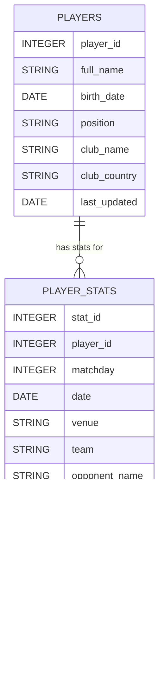

# USMNT Data Pipeline - HR Analytics Example

## Overview

This project is a **toy example of a people analytics data pipeline** using the U.S. Men's National Soccer Team (USMNT) as a dataset. While the data here comes from publicly available sports sources, the principles and workflow mimic what you would build in a real HR analytics environment:

- Collecting data on individuals (employees / players)  
- Tracking their performance (HR metrics / match stats)  
- Storing the data in a database (HR data warehouse)  
- Scheduling automated updates (like recurring HR reports)

This project demonstrates the **foundation of people analytics**: collecting, storing, and updating structured data in a reproducible way.  

In a real HR setting, your data would come from HRIS systems, ATS platforms, learning platforms, and other internal tools. The workflow here is simplified for teaching purposes but illustrates the same concepts.

---

## Why This Approach Matters

In HR Analytics, having a **structured data pipeline** ensures:

1. **Reliable, consistent data** – you can trust your metrics and insights.  
2. **Automated updates** – no manual data copying; new information is always up-to-date.  
3. **Scalability** – as your organization grows, your pipeline can handle more employees, more metrics, and more reports.  
4. **Traceability** – logging and structured processes make it easy to debug and explain analyses.  

Even though we’re using soccer data here, the workflow is analogous to tracking employee demographics, engagement survey responses, promotions, or performance metrics.

---

## Project Structure
```
usmnt_employee_pipeline/
├── db.py # Handles database connection and schema
├── players.py # Fetches player data (like employee detail data)
├── stats.py # Fetches match stats (like performance metrics)
├── update_pipeline.py # Runs the full ETL workflow
├── requirements.txt # Python dependencies
├── logs/ # Log files for scheduled updates
└── README.md
```

---

## Components

### 1️⃣ Database (`db.py`)

- **Purpose**: Store all player and match data in a structured way.
- **Tables**:
  - `players` – like an HR master table with one row per employee/player
  - `player_stats` – like HR performance metrics, linked to `players` by `player_id`
  
**Example of `players` DataFrame**

| player_id | full_name        | birth_date | position | club_name | club_country | last_updated |
|-----------|-----------------|------------|----------|-----------|--------------|--------------|
| 101       | Christian Pulisic | 1998-09-18 | LW       | Chelsea   | England      | 2025-09-06   |
| 102       | Gio Reyna       | 2002-11-13 | AM       | Dortmund  | Germany      | 2025-09-06   |

**Example of `player_stats` DataFrame**

| player_id | matchday | date      | venue | team | opponent_name | match_report_url           | result | position | goals | assists | yellow_cards | minutes_played |
|-----------|----------|-----------|-------|------|---------------|---------------------------|--------|----------|-------|--------|--------------|----------------|
| 101       | 1        | 2025-08-23| H     | USA  | Mexico        | /usa_mexico/index/12345   | 2:1    | CF       | 1     | 0      | 0            | 90             |
| 102       | 2        | 2025-08-29| A     | USA  | Canada        | /usa_canada/index/12346   | 0:2    | AM       | 0     | 1      | 0            | 13             |

---

### 2️⃣ Player Data Fetcher (`players.py`)

- **Purpose**: Collect “employee detail” data on all USMNT players.  
- Returns a **Pandas DataFrame** for easy insertion into the database.  
- In HR, this step is like pulling a report from your HRIS with employee name, role, team, location, hire date, etc.  

**Example DataFrame Output**

| player_id | full_name | birth_date | position | club_name | club_country | last_updated |
|-----------|-----------|------------|----------|-----------|--------------|--------------|
| 101       | Christian Pulisic | 1998-09-18 | LW | Chelsea | England | 2025-09-06 |

---

### 3️⃣ Player Stats Fetcher (`stats.py`)

- **Purpose**: Track detailed stats for each player per match.  
- Returns a **Pandas DataFrame** ready to save in the `player_stats` table.  
- In HR, this is like pulling weekly/monthly performance metrics, engagement scores, or sales numbers.  

**Example DataFrame Output**

| player_id | matchday | date | venue | team | opponent_name | match_report_url | result | position | goals | assists | yellow_cards | minutes_played |
|-----------|---------|------|-------|------|---------------|-----------------|--------|----------|-------|--------|--------------|----------------|
| 101       | 1       | 2025-08-23 | H | USA | Mexico | /usa_mexico/index/12345 | 2:1 | CF | 1 | 0 | 0 | 90 |

---

### 4️⃣ Update Pipeline (`update_pipeline.py`)

- **Purpose**: Run the full ETL pipeline: fetch players, fetch stats, save to database.  
- Includes **logging** for traceability.
- Designed to be scheduled by **cron** or another scheduling tool.

**Workflow Example (High Level)**:

1. **Fetch player data** → `get_us_players()` → DataFrame  
2. **Save player data** → `save_players_to_db(df)` → Database  
3. **Fetch match stats** → `update_player_stats(df)` → Database   
4. **Save match stats** → `save_player_stats_to_db(df)` → Database  
5. **Log success/failure** → `/logs/update_pipeline.log`  

In HR Analytics, this step feeds our data warehouse, which enables us to create **daily/weekly HR dashboards** that automatically pull from multiple sources.

---

## Scheduling with Cron

Instead of manually running the pipeline:

- Use cron to run `update_pipeline.py` automatically at a set time.  
- Example: Every Monday at 10am Eastern:

```bash
0 14 * * 1 /usr/bin/python3 /path/to/project/update_pipeline.py
```

---


Cron handles scheduling; the script exits cleanly after each run. Logging keeps a record of successes/failures.



This shows a one-to-many relationship: each player can have multiple match stats records.

---


## Notes for Beginners

- This workflow uses Python and SQLite for simplicity.
- In a real HR Analytics setting, you would replace web scraping with APIs or direct database queries to your HRIS, ATS, or payroll system.
- The workflow demonstrates the core concepts: data ingestion, relational storage, unique IDs, foreign key relationships, and automated updates.
- You can expand this by adding more tables (departments, roles, engagement surveys) and scheduling incremental data loads.

## Summary

This toy example shows how a small, automated data pipeline can form the **foundation of a People Analytics platform**:

1. Centralized, structured data.
2. Relational linking between entities (players → match stats / employees → HR records).
3. Scheduled updates to keep analytics fresh and reliable.
4. Clear separation of components for maintainability and scalability.
